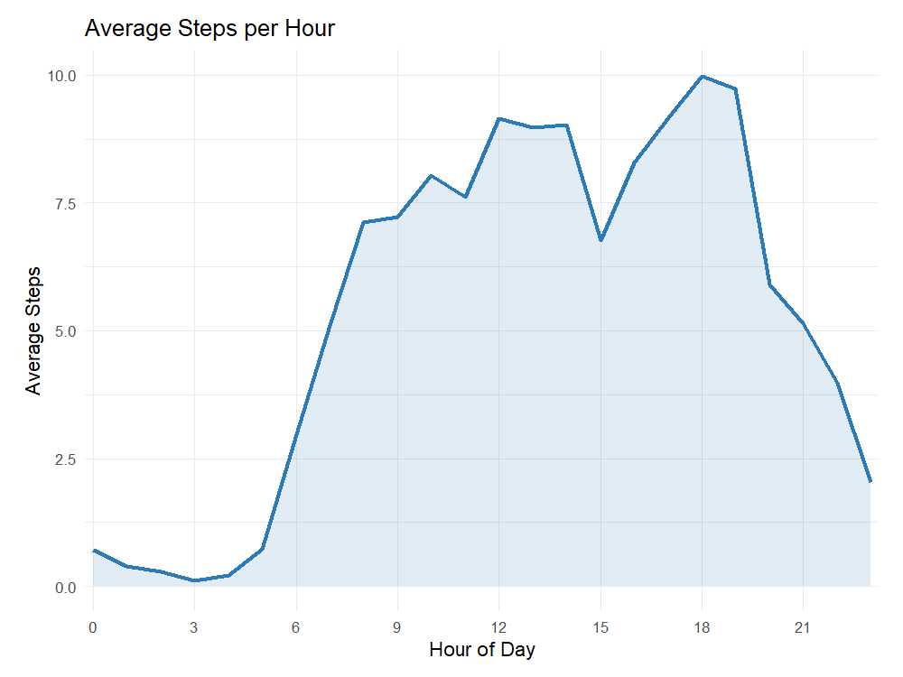

Capstone Project from the Coursera Certificate in Google Data Analytics
FitBit Analysis
================

# Smart Device Growth Opportunities

### What can trends in smart device use tell us about marketing opportunities?

##### Richard Overman

##### 02/02/26

### Purpose: Find Trends in Smart Device Data

##### \* Data Used: FitBit Fitness Tracker Dataset: <https://www.kaggle.com/datasets/arashnic/fitbit>

##### \* Data Preparation: Merging of Daily Activity and Sleep Datasets

##### \* Analysis: Comparison across multiple categories, day of week, time of day.

### Total population of samples in Daily Activity dataset.

##### \* Top population includes devices with 24 hours (1440 minutes) of sedentary minutes – devices not worn all day.

##### \* Bottom population suspected to be devices worn 24 hours.

``` r
ggplot(data=daily_activity, aes(x=TotalSteps, y=SedentaryMinutes, color=LightlyActiveMinutes)) + geom_point() + labs(title="Daily Activity") + theme(legend.position=c(0.8,0.2))
```

<!-- -->

### Average Usage per Day / Week

``` r
# Summarize first
hourly_step_avg <- minute_steps %>%
  group_by(hour) %>%
  summarise(
    avg_steps_hour = mean(Steps, na.rm = TRUE),
    .groups = "drop"
  )

# Now plot the averages
ggplot(hourly_step_avg, aes(x = hour, y = avg_steps_hour)) +
  # Subtle area fill under the line
  geom_area(fill = "#2c7bb6", alpha = 0.15) +
  
  # Main line (thicker for better visibility)
  geom_line(linewidth = 1.2, color = "#2c7bb6") +
  
  # Optional: small points at each hour for emphasis
  # geom_point(size = 2, color = "#2c7bb6", alpha = 0.8) +
  
  labs(
    title    = "Average Steps per Hour",
    x        = "Hour of Day",
    y        = "Average Steps"
  ) +
  
  # Key change: ticks & labels every 3 hours, including 24
  scale_x_continuous(
    breaks = seq(0, 24, by = 3),
    labels = c("0", "3", "6", "9", "12", "15", "18", "21", "24"),
    expand = c(0.01, 0)   # reduces empty space at edges
  ) +
  
  theme_minimal(base_size = 13) +
  theme(
    #plot.title      = element_text(size = 16, margin = margin(b = 10)),
    #axis.title      = element_text(face = "bold"),
    #axis.text.x     = element_text(size = 10),
    panel.grid.major.x = element_line(color = "grey92", linewidth = 0.35),
    panel.grid.minor.x = element_blank(),
    panel.grid.major.y = element_line(color = "grey92", linewidth = 0.4),
    plot.margin     = margin(12, 16, 12, 16)
  )
```

<!-- -->

``` r
# Summarize first
hourly_steps_avg <- hourly_steps %>%
  group_by(day_of_week) %>%
  summarise(
    avg_steps_per_weekday = mean(StepTotal, na.rm = TRUE),
    .groups = "drop"
  )
hourly_steps_avg <- hourly_steps_avg %>%
  mutate(day_of_week = factor(day_of_week,
                               levels = 1:7,
                               labels = c("Sunday", "Monday", "Tuesday",
                                          "Wednesday", "Thursday", "Friday", "Saturday")))
# Now plot the averages
ggplot(hourly_steps_avg, aes(x = day_of_week, y = avg_steps_per_weekday)) +
  geom_col(fill = "steelblue") +           # bars are very common for averages
  labs(
    title = "Average Steps by Day of Week",
    x = "Day of Week",
    y = "Average Steps"
  ) +
  theme_minimal()
```

<!-- -->

### Merged Daily Activity with Sleep Data

``` r
ggplot(data=combined_data, aes(x=TotalSteps, y=SedentaryMinutes, color=TotalTimeInBed)) + geom_point() + theme(legend.position=c(0.9,0.21)) + labs(title="Steps vs Sedentary Minutes")
```

<!-- -->

``` r
ggplot(data=combined_data, aes(x=SedentaryMinutes, y=TotalTimeInBed, color=TotalSteps)) + geom_point() + theme(legend.position=c(0.85,0.75)) + labs(title = "Sleep vs Sedentary Minutes")
```

<!-- -->

